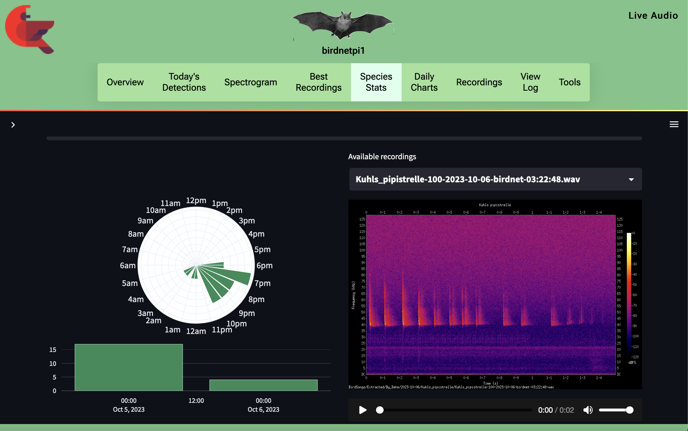
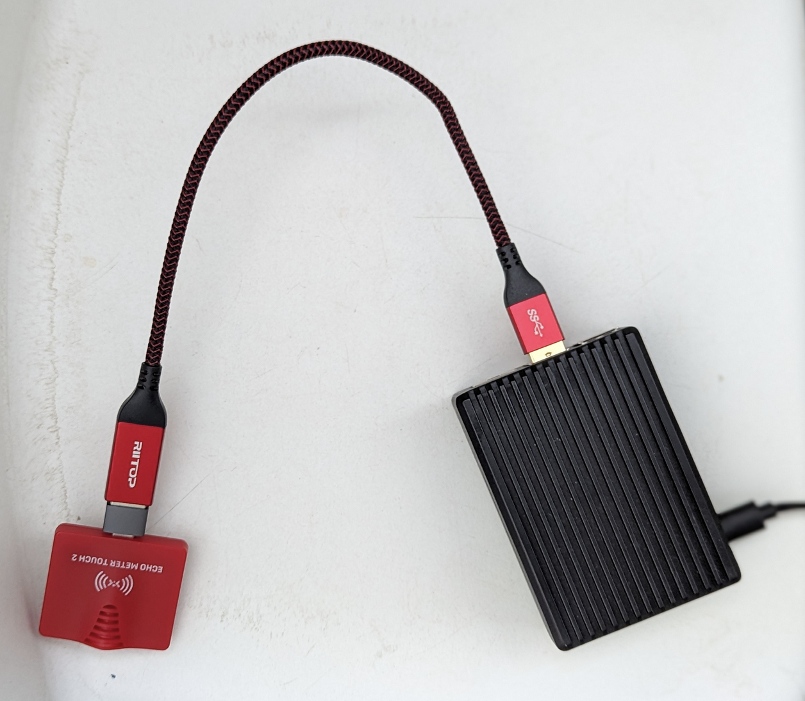

## BattyBirdNET-Pi  Automated real-time bat detector

**Note: The system is under heavy development and not (as yet) fit for production use. 
It is fully functional, however. You are welcome to try it and send feedback.**

### Purpose
Ever wondered which bat is flying in your yard and when? BattyBirdNET-Pi is readily assembled and will help you getting to know the 
night-life around you. Can also be placed remotely with a power source.

### Features

* Scans ultrasound with 256kHz sampling rate continuously 24/7 
* Automated bat ID using the companion https://github.com/rdz-oss/BattyBirdNET-Analyzer.
* Inherits many great things from BirdNET-Pi
* Right now only enabled for European bat species
* US species will be added soon

Open to the core:
* Can be assembled fully on open hardware (RaspberryPi, Audiomoth) 
* Open source operating system 
* Open source software runs it 
* Open data from GER, UK, FR, SE, USA, ... used to train the machine learning component
* Open source machine learning project for bat call identification

only limitation: you cannot use it to build a commercial system.

### Usage scenarios
1. You are a person who is interested in nature, including bats, and are not afraid of a little setup work. 
Put it in your garden or other place of interest and get recordings of the bat calls at night. 
See a daily and even yearly statistic of activity. If the classifier is not always right, so what?
2. You are looking for a bat logger. This solution will be triggered by bats, filters out most triggers by 
noise including cars and crickets. You can ignore the classifier results, download the data to your machine and use any software you like to 
determine the species. You will have a nice interface to work with inherited from BirdNET including system contols
as well as WIFI connectivity. If placed within an existing WIFI networks, you can get all type of alarms you like to 
your phone, email, messenger etc.
3. You are a nature conservancy or education group, a national park or the like? Offer a 24/7 live view into the bat life 
of your facilities, managed areas or similar. The interface can be opened to the internet.
4. You enjoy making thinks? Why not become a contributor ? There is need for testing, housing development,
integration of ML components, data collection, software development.


### License

Enjoy! Feel free to use BattyBirdNET-Pi for your acoustic analyses and research. If you do, please cite as:
``` bibtex
@misc{Zinck2023,
  author = {Zinck, R.D.},
  title = {BattyBirdNET-Pi: Automated real-time bat detector},
  year = {2023},
  publisher = {GitHub},
  journal = {GitHub repository},
  howpublished = {\url{https://github.com/rdz-oss/BattyBirdNET-Pi }}
}
```

LICENSE: http://creativecommons.org/licenses/by-nc-sa/4.0/  
Also consider the references at the end of the page.

### Screenshot
Overview page


Including stats and spectrograms to 128 kHz


### System components

* A RasPi 4B with 4GB or more, likely also Pi 5 will work. Use some form of passive or active cooling!
* Power supply for the Raspi and an sd card - choose a large one 64 Gb +
* A USB microphone for ultra sound: tested on audiomoth 1.2 and wildlife acoustics echo meter touch 2
* USB cable (USB C female to USB 3, 1.2m) or a USB 3 to USB 3 cable and a USB to USB C adapter
* Optional: You can use a power bank to run the system as long as the power lasts at any location. 
You might want to add some form of rain protection.

If you use the audiomoth, you will have to set the sampling frequency to 256kHz or the system will overload after a few hours.

It is easily assembled


### Install
* Install Raspbian OS 64 bit lite on the sd card. Set a system user, name and configure your WIFI. If you have not done this before, 
you can follow the instructions for installing BirdNET-Pi to the point of flashing the sd card with the operating system ([see here](./README-BirdNET-Pi.md)). 
* After that you will log in to the RasPi with your username and password via ssh (it should be in your wireles LAN after booting)
* You call the install script from this repository (not from BirdNEt-Pi - unless that is what you want to install):
```sh
curl -s https://raw.githubusercontent.com/rdz-oss/BattyBirdNET-Pi/main/newinstaller.sh | bash
```
Done. You can connect to the WebUI via your browser if you are in the same WIFI network. It should show up under http://name-you-gave-it.local .
This sometimes does not work depending on your router configuration. You can look up the ip address given to the BattyBirdNET-Pi
in your router and call that directly from the browser, e.g. http://192.168.178.XX . Alternatively, tools like Ning (https://f-droid.org/packages/de.csicar.ning/) on your smartphone will
list all the devices in your network. The BattyBirdNET-Pi should show up.

### Is it good enough?
That depends on your purpose. Use your judgement, no guarantees or liability. I would not currently use it for fully automated biomonitoring. That said,
in test runs in Munich (October) the error rate was approximately (rough estimate, no science):
* Wrong 3% for every bat species flying plus 8% on noise falsely detected as bats 
* So at that location 4 bats species flying simultaneously would currently lead to approximately:  12%+8% = 20% wrong assessments on species level
per night (not counting false noise detections during daytime).
This may differ for other locations and background noises. 
* Under development - moving target 


### Acknowledgements
* This project would not have been possible without the developers of BirdNET and BirdNET-Pi. 
By choosing to share under an OSS license, you have enabled us to make this possible for bats.
* Thanks to the Animal Sound Archive Berlin, ChiroVox, NABAT and XenoXanto databases and individual data donors:
Kelvin R. (UK), Guillaume M. (FR), Svardsten L. (SE), Zinck R. (GER).
* Thank you for your great work at testing Kelvin!
* Thank you community for tips and testing! Your help is much appreciated!

### References

### Papers

FROMMOLT, KARL-HEINZ. "The archive of animal sounds at the Humboldt-University of Berlin." Bioacoustics 6.4 (1996): 293-296.

Görföl, Tamás, et al. "ChiroVox: a public library of bat calls." PeerJ 10 (2022): e12445.

Gotthold, B., Khalighifar, A., Straw, B.R., and Reichert, B.E., 2022, 
Training dataset for NABat Machine Learning V1.0: U.S. Geological Survey 
data release, https://doi.org/10.5066/P969TX8F.

Kahl, Stefan, et al. "BirdNET: A deep learning solution for avian diversity monitoring." Ecological Informatics 61 (2021): 101236.

### Links

https://www.museumfuernaturkunde.berlin/en/science/animal-sound-archive

https://www.chirovox.org/

https://www.sciencebase.gov/catalog/item/627ed4b2d34e3bef0c9a2f30

https://github.com/kahst/BirdNET-Analyzer

https://github.com/mcguirepr89/BirdNET-Pi
